In this blog post I will talk about a course I really liked this semester: **The Art of Creating Tangible Surfaces**, this is a 3D printing course, in which the goal was to:

- Create a system of **interlocking** flat pieces (no thicker than 0.5mm), that could form a surface of 1x1m (later halved down for a lack of time)

This introduction is written after the course has finished, but after this section, you'll see a blog on my experience and progress.

I have been doing 3D printing from a long time now, I have my own 3D printer, and **Ender** 3, bought for cheap, repaired for cheap, and upgraded for not so cheap, so I kind of knew what to expect.

However, something which was completely new to me, is the restriction to flat surfaces, basically **2D**.

This allowed students with no previous knowledge of 3D printing to do simple designs.

But I was mainly surprised by the fact that, even with this restriction which at first hand seems huge, there's still a lot of room to play and explore designs. Everyone proposed different designs, different interlocking mechanisms, and some even folded their parts to reclaim 3D space.

Now onto the blog!

# WEEK1

## Learning About tools

This week I started leargning how to use Computer-Aided Design Softwate (CAD).
For me, this was the main hurdle of this course, as I am already familiar with 3D Printing, and a bit of 3D modeling in Blender.

The software recommended by the course was Autodesk Fusion, The problem is I use Linux, and I don't want to set up a Windows VM for this.
I tried their online version, but I found it to be really janky and slow.

So I moved to another online tool I have heard before, [Onshape](https://cad.onshape.com), I was happy to find a friendlier interface, with the same capabilities of fusion, and compared to fusion, it was way faster and snappier.

## Finding Inspiration

The main idea was to talk about my country, Venezuela.

And I had a lot of ideas.

### Music

First I thought about music, Venezuela has a lot of folkloric [music genres](https://fr.wikipedia.org/wiki/Venezuela#Musique), like merengue, cumbia and gaita. Salsa in particular popped into my mind as I love this genre (thanks to [Oscar D'Leon](https://www.youtube.com/watch?v=gxlB1B9emDc)).

I thought maybe I could figure out a way to chop up a salsa partition, into different interlocking mosaics.

I really liked this idea but I understood fairly quickly how time consuming this would be, because sheet music can have an infinity of note combinations, with many different sizes, etc etc.

### Nature
Then I thought about nature, Venezuela has a LOT of biodiversity, I immediately thought of two things:

- The capital is full of macaws flying everywhere 
- Venezuela has great tropical reefs in which I really loved to snorkel as a child 

 
But I wasn't fond of this approach, I believed I could do something nice.
I dropped this idea, because something about raising awareness of nature through sheets of plastic didn't sit right with me.

I may have done this if it was really biodegradable plastic, but we are using PLA or PETG in this course.

### Art 

I finally thought about known artists from Venezuela, for some reason, kinetic art is really popular in Venezuela, 

Mainly through these artists:

#### [Carlos Cruz Diez](https://en.wikipedia.org/wiki/Carlos_Cruz-Diez)

#### [Jesus Soto](https://en.wikipedia.org/wiki/Jes%C3%BAs_Rafael_Soto)

#### [Alejandro Otero](https://en.wikipedia.org/wiki/Alejandro_Otero)

#### [Gertrud Louise (Gego)](https://en.wikipedia.org/wiki/Gego)

This was really inspiring, as you can see their art is mostly 3D, I thought it was going to be hard to do similar stuff with a flat 3D printed surface, but then I saw this piece by Soto and it clicked:

I can carve the inside of the surface, to force a 3D aspect, I had two main Ideas, doing geometrical shapes with spirals, which spring outwards, or doing actual shapes with foldable tabs.

I got my scissors and quickly tested it on paper 

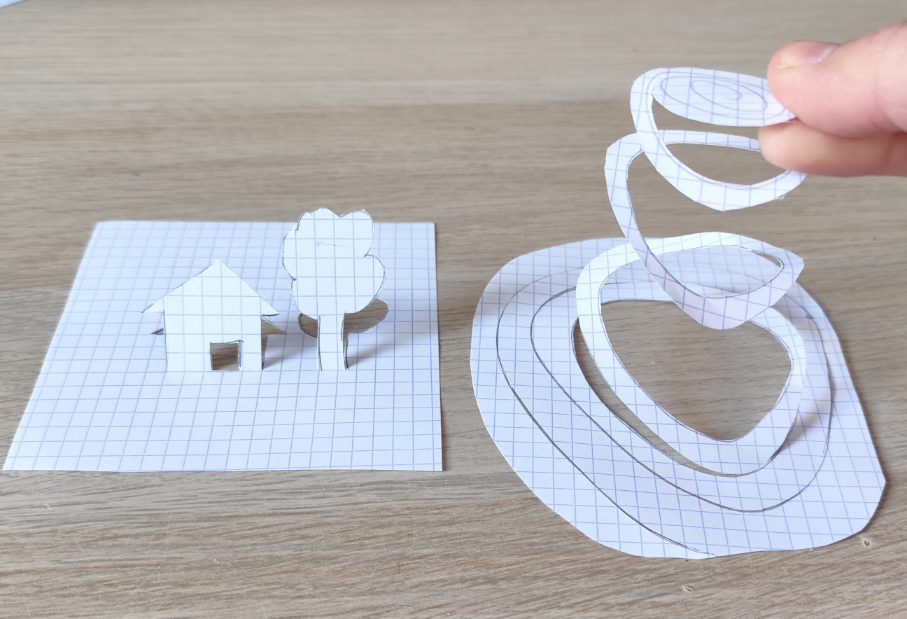

# First iteration

I decided to try out the spiral design, I ended up with this:

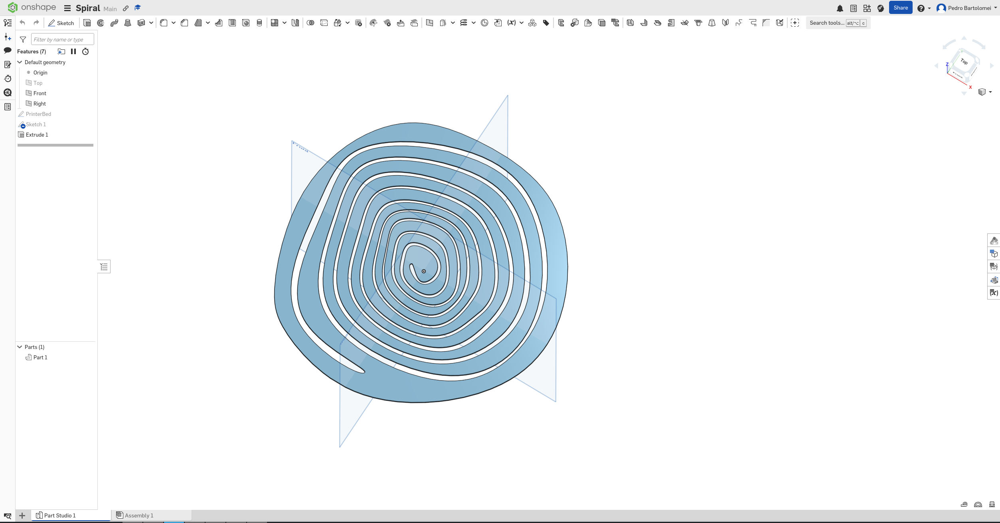

I tried both offset and slot, to carve the interior of the spiral, but onshape kept failing, my guess is that it struggled with organic shapes, I might move to Blender if this persists, or simplify the design even further.

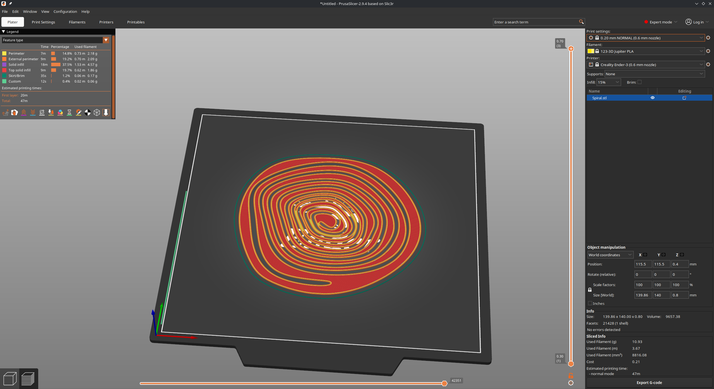

And I undusted my old Ender3.

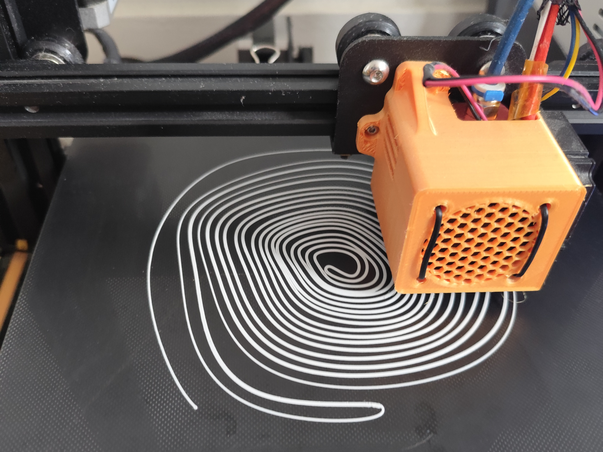

It resulted in this:

|   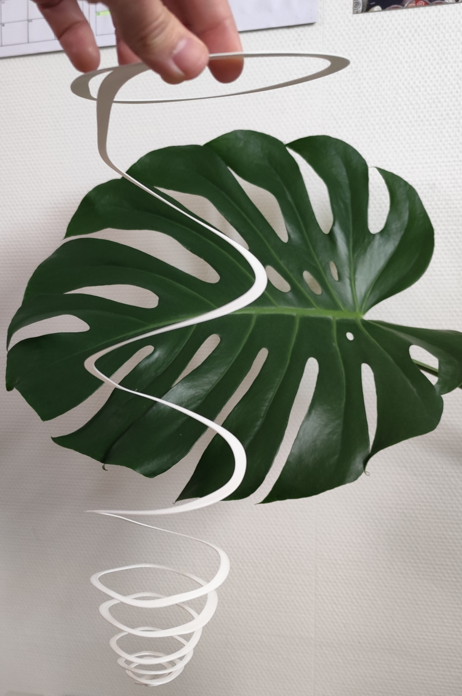 |   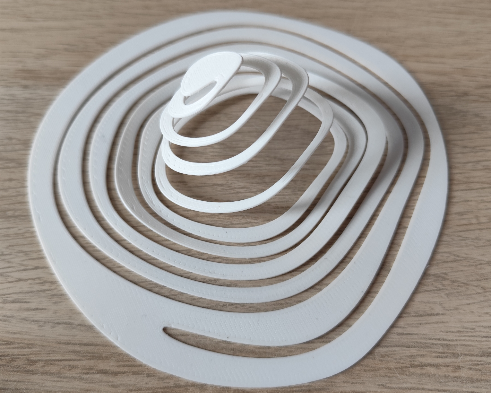 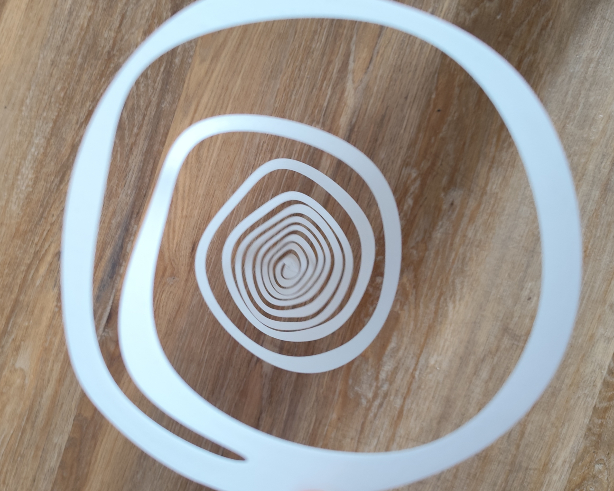 |
| --------------------------------- | -------------------------------------------------------------- |

It ended up having the same problem as the paper version, it is not rigid enough.

Against gravity it folds out way too much (**37cm**), and under gravity it collapses way too much.

To increase rigidity I see two main solutions:

1. Reducing the gap inside the spiral, currently it is around 1-2mm, technically I should be able to get closer to the nozzle width, which is 0.6mm for my Ender3.

2. Increasing the amount of layers, currently the surface is 0.8mm thick, with 3 layers, I can increase either the thickness or the number of layers.

I'll try to use the first approach, as the latter would greatly increase print time.

I still don't know where I am going with this, if I want to keep it more abstract, with different shapes, or If I want something more representative, like assembling small environments with the tabs cut ins in the paper example.

If the spring part is too complicated, I'll probably keep only the tab idea, although I found the springs more promising.

# WEEK 2

## Connectors and spirals 

This week I started working in the connectores I wished to use with the spirals, I wanted the connectors to be integrated to the main piece.

I first came up with this design, for a connector without the spiral:

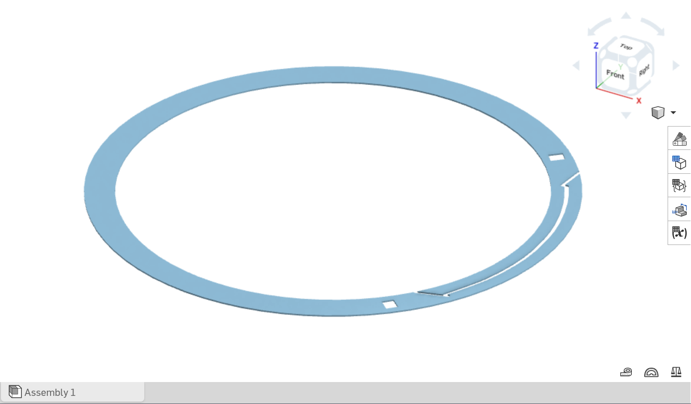

It was kind of hard to desing the two prongs, in a symmetrical manner, because they affected the inner and outer part of the circle on it's own, then I printed one Ring to test, and it fitted, just fine.

The first iteration had the holes way to far back, and this curved a lot the circle, so I put the hole closer and this fixed this issue.

Then I added the spiral:

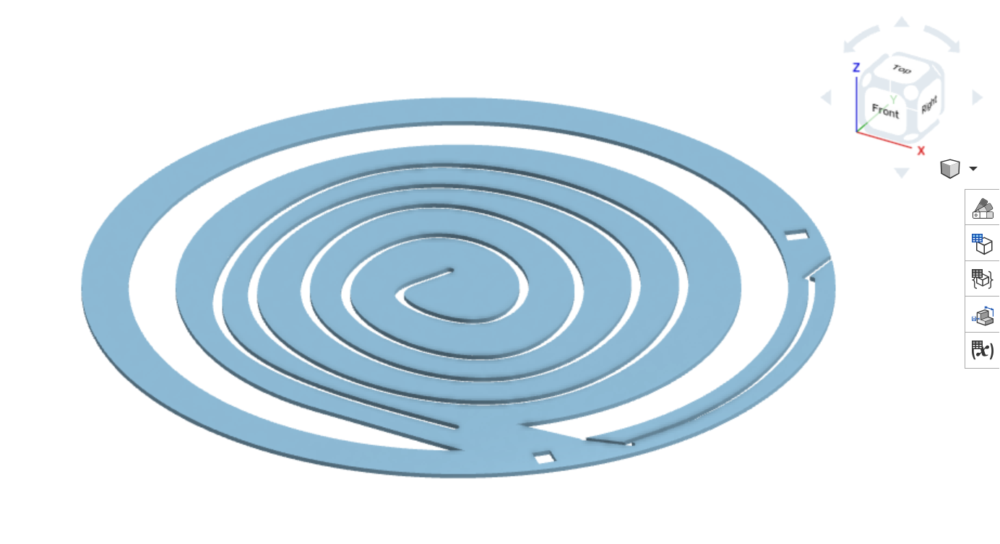

I printed 4 of them, and was a bit frustrated because, as the holes are rather big the spirals moved everywhere and it was really hard to form a square shape out of it.

## "Final" Iteration and sad conclusions

To restrain a bit more the travel of the pieces, I made the following additions:

this partly fixed the problem, even if there was a lot of travel.

But it introduced another problem, 4 prongs, 4 holes, twice as much as before, so the circle got really curved, which further deformed the rings, and added asymmetry.

But I noticed only then that, the center spiral was really finnicky as well, it wasn't falling and curling as I wanted.

The shape of the spiral played on too many factors:

- Weight
- Size of the spiral
- Number of layers
- Thickness and with of each spiral section

I concluded 2 things:

- I didn't had the time to fine tune all these parameters, to make something like I had in mind.
- With the size restrictions of pieces having an area of 5x5cm, making the satisfiying drooling spirals I wanted, this was practically impossible

I had to find a new design

# WEEK 3

## New design! new hopes!

I knew we had a lot of colos to choose from all the PLA spools. 
I got inspired by [Carlos Cruz Diez](https://en.wikipedia.org/wiki/Carlos_Cruz-Diez), and mainly this piece:

I figured that if I could print strips, respecting the 5x5cm **area** per piece restriction I could maybe reproduce a roughly similar thing.

I never took the time to really study the works of Carlos Cruz Diez, even if his works where pervasive and everywhere in venezuelan culture.

But it was really interesting to see how mixing colors really close by, makes our brain change their perception, and blend colors together.

I came up with this neat and simple design: 

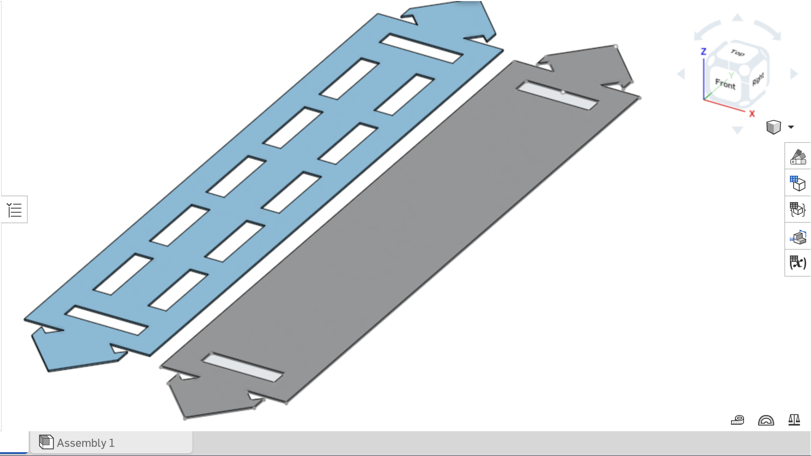

We can see how the hole riddled piece is meant to allow horizontal movement, and the other fuller pieces are just there for color.

I left connection holes in the fuller pieces, in case I dediced to not use horizontal pieces everywhere later on.

Here we can see my first test:

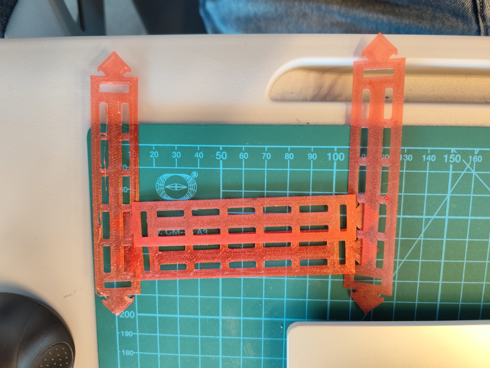

The holes where a bit big, I had to shave some extra milimiters to make sure it holds.

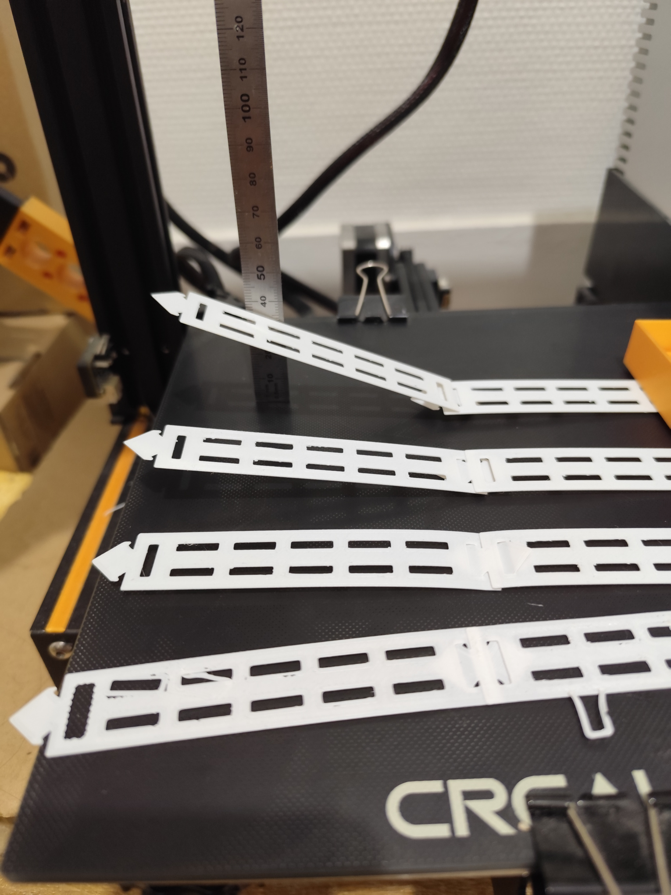

Here I was figuring out how many layers to use, for a 0.4 nozzle, and 0.10 layer height.

From front to back we have 1, 2, 3, 4 layers, I finally went with 3, I found it was a nice limit between, sturdinness, flexiblity, and limited the inclination when clipping pieces together.

Next week I'll start mass printing.

# WEEK 4

## Mass Printing!

So basically I started mass printing now, there isn't to much to add to this.

I knew I wanted the following colors: Black, Red, Yellow, Blue

So I launched a few machines with these colors, and in the meanwhile came a bit with this design:

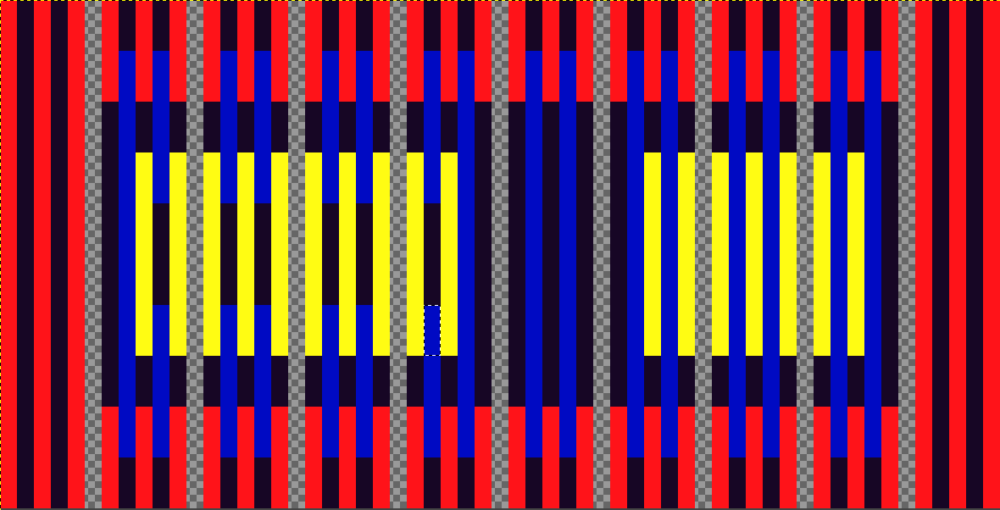

It is 1x1m, and I wasn't really convinced by the shape, but then I looked a it far back, and I saw that carloz cruz diez, color addition effect I was looking to reproduce (I don't know if there's a better term to describe this effect) 

# WEEK 5 

This week I finished 3D printing all pieces.

But the printing surface also got reduced to 50x50cm instead of 1x1m, which made things simpler, I came up with another design to account for this:
![[images/3DP/Design2.png]]

## End

This week I finished 3D printing all pieces.

I assembled everything, I miscalculated my already rough calculations of the final size, the final piece is roughly 55x50 cm, I underestimated the size the horizontal connectors would add.

I have mixed feelings of the result, looking at it close by is not particularly beautiful.
But it is really nice when it gets back-lit as it plays a bit with the colors, or when looked a bit from far away, which makes the piece look less "rough".

I also mixed the insertion of pieces, one strip inserted from up, one from down, which made the piece not-flat (but made a nice zipper looking pattern on the horizontal pieces).
On hindsight I should have put all strips on the same side, this would have increased the flatness, and allowed for better symmetry.

## Exposition and my favorites 

| 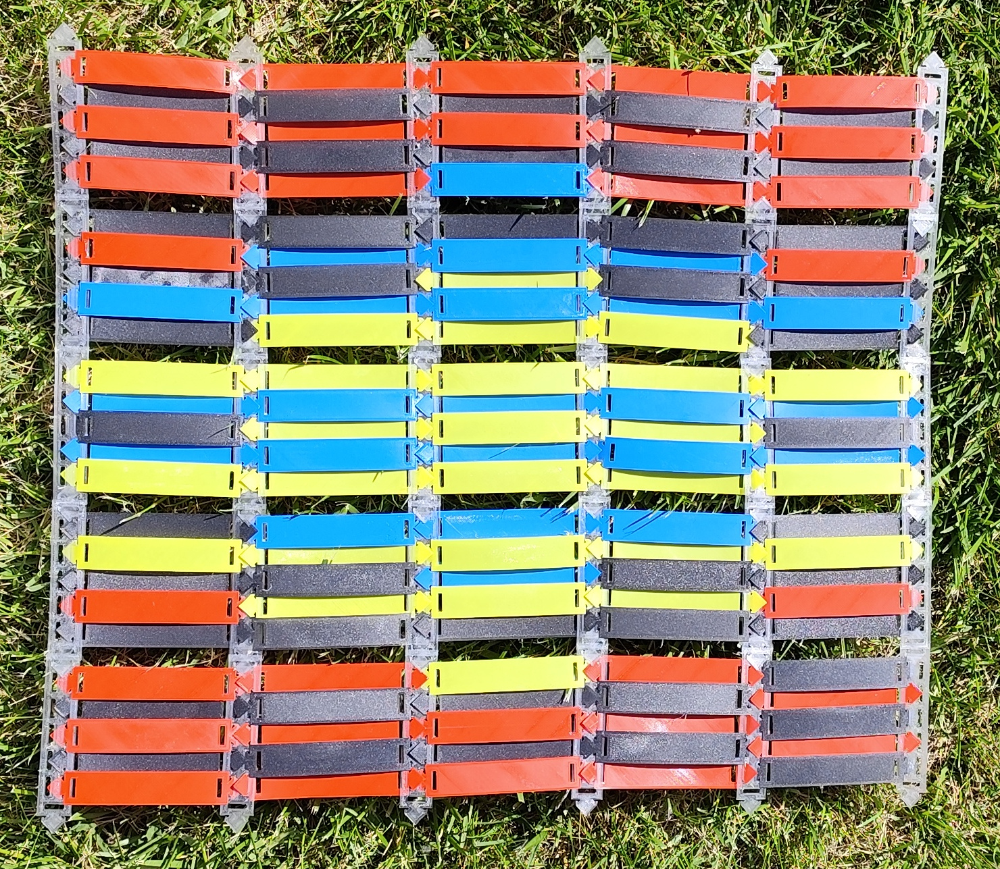 |
| ---------------------------- |
| The Final Result!            |

| 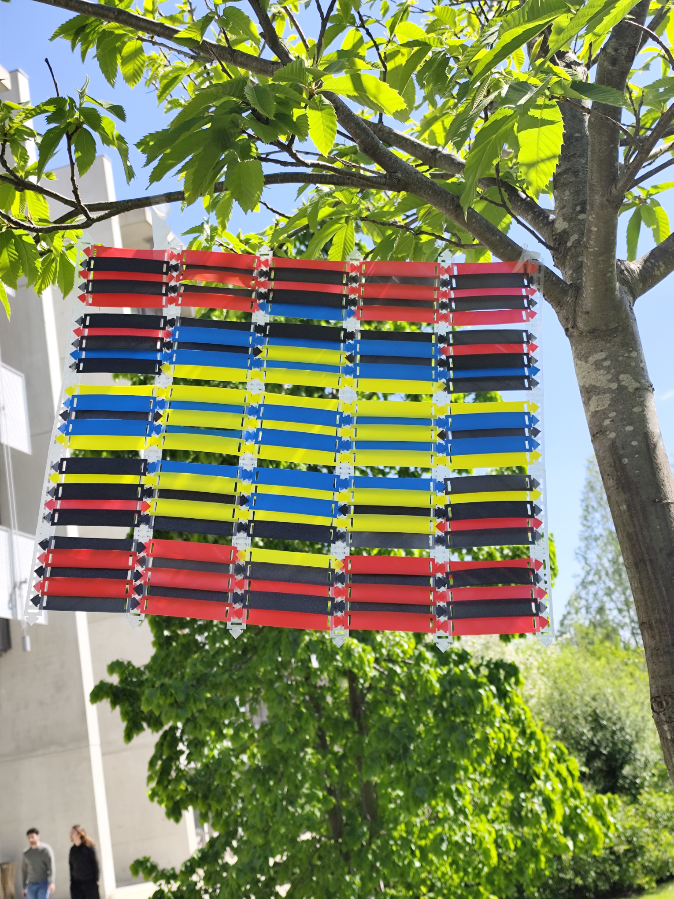                                        |
| ------------------------------------------------------------------- |
| A poor attempt at making it interact with light (making it backlit) |

| 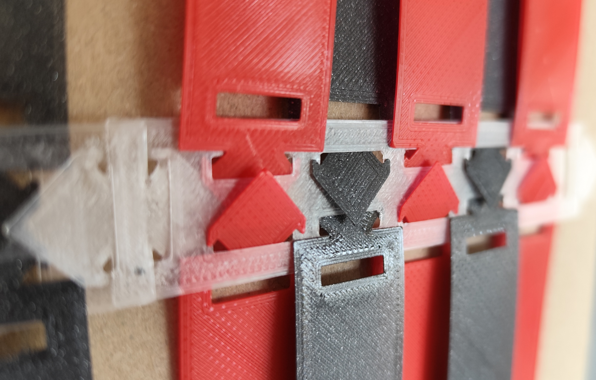        |
| ---------------------------------------- |
| Nice interlocking pattern between blocks |

# My favorite designs

| 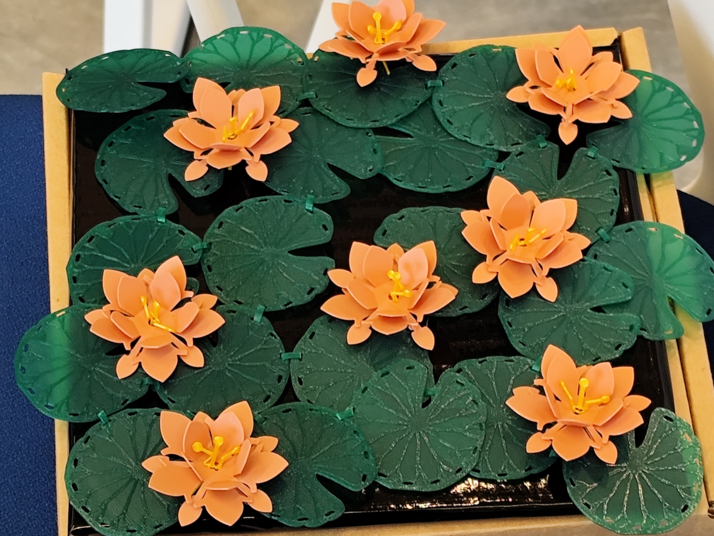                                                           |
| --------------------------------------------------------------------------------------- |
| This is for me one of the best designs, a clever use of 3D, a beautiful organic design. |

| 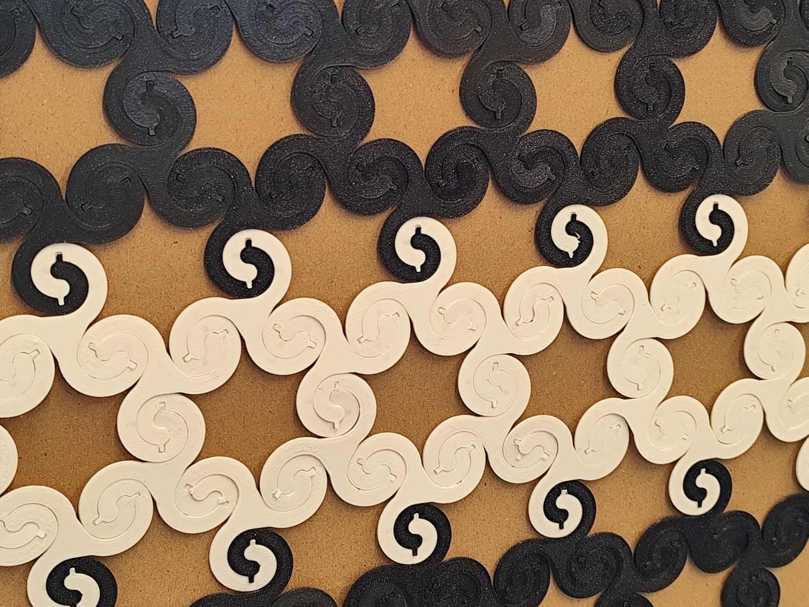                                                                                                                                                                                           |
| ----------------------------------------------------------------------------------------------------------------------------------------------------------------------------------------------------------------------- |
| This one to me is really pleasing, it stays both organic and repetitive, with a pretty clever and straightforward clipping mechanism. a great use of the [triskel](https://fr.wikipedia.org/wiki/Trisk%C3%A8le) symbol. |

|                                                                                                 |
| ------------------------------------------------------------------------------------------------------------------------- |
| I really liked these one mainly because of all the small details it had, even the connectors have both a moon and a star. |

| 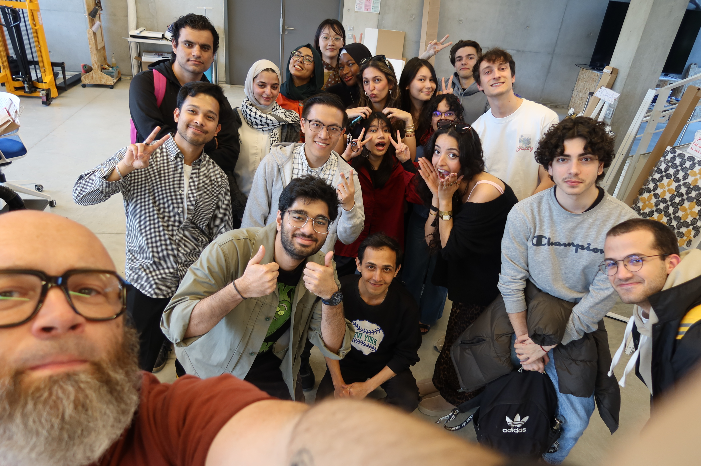 |
| ------------------------------ |
| The whole Class!               |
