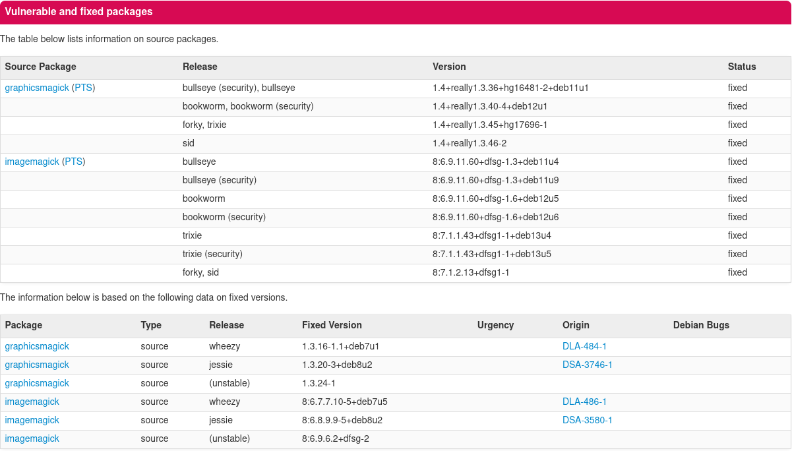
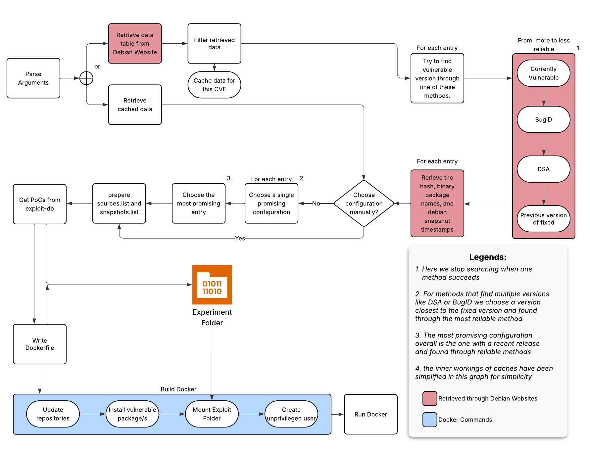

# Introduction

## Defining DECRET
DECRET is an open source tool developed at Télécom SudParis, in partnership with Orange. It aims to semi-automatically reproduce userspace vulnerabilities in Debian, through the generation of vulnerable Docker images.

The idea is that, given a CVE identifier, to automatically retrieve a correct vulnerable package version and put it in a Docker image, with the corresponding Debian release in which they were first found, in a stable and reliable manner.

Moreover if any proofs of concept (PoCs) are available in exploit-db, it will download them in a shared directory.

But we also have to take into consideration what DECRET doesn't do, like extra configuration needed for the environment to be vulnerable or to automatically test or exploit the image

## Use cases of DECRET

### Vulnerability research
This tool would allow information security researchers and security teams to test and learn about vulnerabilities without struggling too much on setting up the environment, saving a lot of time and thus helping to keep up to date with new vulnerabilities.
Which also means it would be overall easier to provide and develop systems for detection, blocking,patching or safely sandboxing the vulnerable environment.

### Cyber-Ranges
Cyber-Ranges are environments used for learning about cybersecurity, by simulating real life cases of vulnerable environments as they could be found in the wild, which often involve the chaining of multiple vulnerabilities and attack vectors.
These recents years these Cyber Ranges have gained in popularity through big platforms like, TryHackMe, HackTheBox, RootMe.
One could imagine how easier it would be to set up and make up-to-date environments like these if the vulnerable package retrieval was completely done by DECRET, and the only thing left to do was to set up the attack chain and some extra manual configuration.

### Information Archival 
This is not directly a feature of Decret, but more of a consequence of using the Debian snapshot archive for building the images, Decret technically reproduces old CVEs, in a very similar way of what they were like and the environment they were in at the time of discovery.

# State of the Art
The state of the art on automatic vulnerability reproduction is rather deceiving, what we can find at the time of writing, are mainly repositories or collections of already set-up environments (except KernJC), I could find three main examples:

- [kernJC](https://github.com/NUS-Curiosity/KernJC): An automatic vulnerable environment generation specific to Linux kernel vulnerabilities.

- [Vulhub](https://github.com/vulhub/vulhub): An open source project which currently has a collection of around 300 Docker images that are tailored to reproduce specfic CVEs. 

- [OWASP VWAD](https://owasp.org/www-project-vulnerable-web-applications-directory/): (Vulnerable Web Applications Directory): A collection of known vulnerable web applications, which are containerized through different methods.

Some honorable mentions:
- [VulnLab](https://github.com/Yavuzlar/VulnLameta): 120 vulnerable machines, offering a pentesting environment.
- [Metasploitable3](https://github.com/rapid7/metasploitable3): a single VM with a ton of vulnerabilities.

If we compare DECRET with these solutions we can gather some conclusions:

These approaches, if properly configured, provide environments that are more satisfying to tinker with, as they were previously configured and tested by someone else beforehand, but it’s also a hindrance which limits the amount of CVEs we can reproduce.

One of the downsides of these approaches is that they are often limited to a field, like web vulnerabilities or kernel ones (even if DECRET is currently limited to userspace vulnerabilities, it has already been considered to expand it to kernel vulnerabilities).

Also, some of these approaches propose vulnerabilities that are not really software-based like weak credentials or secrets, which is out of the scope of DECRET.

And these solutions are also severely limited, [knowing that we ended 2024 with 40,009 published CVEs, up over 38% from the 28,818 CVEs published in 2023](https://jerrygamblin.com/2025/01/05/2024-cve-data-review/). We can confidently say that a couple of hundred user-made environments isn’t enough to keep up to date with the growing number of CVEs.

So this is where DECRET currently comes in, at the start of the pipeline, when we first try to create a vulnerable environment, taking out a good chunk out of the tedious guesswork of finding and installing vulnerable packages.

# Problems and Solutions:

During my internship, I enhanced several aspects of DECRET, focusing primarily on improving the quality and accessibility of CVE metadata.

## Challenges with Existing Metadata:
Available CVE metadata was often incomplete, inaccurate, and lacked a user-friendly query platform.
Vulnerable environments can be reproduced in two ways: installing a vulnerable package and its dependencies in a recent, stable Debian release. Or using the Debian release where the vulnerability was first identified. Each method has advantages, but my DECRET update adopts the latter approach, moving away from reliance on JSON data.
DECRET previously relied on two sources: 
(These examples are tailored for **CVE-2016-3714**)

1. [**JSON Data**](https://security-tracker.debian.org/tracker/data/json): This provides package version status (vulnerable or fixed) for current Debian releases (e.g., Bullseye, Bookworm, Trixie, Sid). However, it lacks historical data to confirm if a release was ever vulnerable, limiting its use for the recent-release method.

2. [**CVE-Specific Page**](https://security-tracker.debian.org/tracker/CVE-2016-3714): This includes two tables:
Source Packages Table: Mirrors the JSON data.
Fixed Versions Table: Indicates a release was vulnerable if a fix exists for it.

DECRET primarily used JSON data, which supported the recent-release method but required inferring vulnerable versions from the version prior to the fixed one.
I thus shifted DECRET to exclusively use the CVE-specific page, leveraging the "Fixed Versions" table, which includes:
- Fixed version
- Origin
- Debian Bugs

This enabled two new methods to identify vulnerable versions:

1. **Bug Tracker Search:** If a release has a bug identifier, I searched the Debian bug tracker for a "Found in version" tag, providing reliable vulnerable release and package version data. This method works well for unstable/Sid releases, which often have bug identifiers, but less so for others.

2. **DSA/DLA Search:** For releases with a Debian Security Advisory (DSA) or Debian Long-Term Support Advisory (DLA), I checked for bug identifiers in these advisories and applied the bug tracker method. To ensure relevance, I verified the CVE number appeared on the advisory page, as some bug identifiers may not correspond to the target CVE.

Currently, to choose the most reliable vulnerable configuration, DECRET prioritizes methods the following way, from most reliable to less reliable: Currently Vulnerable, Bug Tracker, DSA/DLA, Previous Version. And if there are multiple releases with the same method, it will choose the most recent release.

## Missing CI pipeline for GitHub:
I implemented a simple pipeline allowing us to test DECRET on specific vulnerabilities,  and extra pytests to verify that the information we retrieve is consistent.

First we lint the code under the decret directory, and run the tests under tests

If everything goes well, we then run DECRET on multiple CVEs, in parallel, to make the process faster, and using the matrix strategy, in a way that allows to continue testing even if DECRET fails to build one of the images,  finally we push these images to the GHCR(GitHub Container Repository)

Only after the images are pushed to the GHCR, we then use Trivy to make a first opinion if we succeeded to reproduce the vulnerable environment, as Trivy cross checks with different databases that the used package versions are indeed vulnerable, but this must be taken with a grain of salt as it is not completely reliable, and some configurations may still be needed to make the image vulnerable.

And at the same time we run a workflow that takes these CVEs, and tries to exploit the vulnerable images, but for the time being this is highly experimental. Because of the nature of vulnerabilities, it is hard to exploit all of them in github actions, and to come  up with a generalized definition of a “successfully exploited environment”

## Getting rid of the selenium dependency:
Before, DECRET used selenium to: 

- Retrieve PoC’s from Exploit Database.
- Retrieve CVE information from the debian security tracker.

Selenium’s browser driver, while effective for JavaScript-heavy sites, added unnecessary overhead for our needs. DECRET now uses Python Requests, a faster and simpler solution for accessing these websites. Additionally, a cached .csv file accelerates PoC identifier lookups.

## Minor quality of life improvements and code maintainability:
- Converted the CVE descriptor dictionaries to Python classes to enhance code readability and maintainability.
- Added the –dont-run flag to only build the image and not run it
- Added the –beefy flag to install extra tools for analyzing vulnerabilities
- Added filtering flags to specify which method to use for information retrieval
- Added support for new releases (bookworm, trixie, sid/unstable)

# Possible improvements

## Kernel Support
This is an obvious area for improvement.
How to implement it in DECRET has already been studied, leveraging tools like [RunCVM](https://github.com/newsnowlabs/runcvm) and [Kata Containers](https://katacontainers.io/).
However, it hasn’t been properly implemented yet.

## Better Usage of the **sid** Release

Currently, when pulling a **sid** image from Docker Hub, DECRET fetches the latest available version.
At the time of writing, this corresponds to the **trixie release (in testing)**. For reproducing older CVEs such as [**CVE-
2014-0160](https://security-tracker.debian.org/tracker/CVE-2014-0160)**, it’s clear that trixie did not exist at that time.
The current workaround is to configure the sid release to only use snapshot sources, so that package versions reflect
their state in, for example, 2014.
However, an interesting extension would be to also pull older **sid** container images (which are available to a certain
extent), corresponding to the year the CVE was discovered.

## Independence from DockerHub
DECRET could build its own Docker containers instead of pulling them from Docker Hub. While this may seem
complex, it would eliminate issues like the [Docker pull rate limits](https://docs.docker.com/docker-hub/usage/pulls/). It would also open the door to further improvements,
such as:

- Creating slimmer or more feature complete environments
- Enabling more precise version control
- Ensuring greater consistency across environments

## Testing on Large Dataset of CVEs
It would be valuable to evaluate DECRET against a large dataset of CVEs to assess:

- How well it reproduces vulnerable environments
- Where it fails
- Why those failures occur

This would provide insight into the tool’s limitations and help guide future improvements.

## Better Identification of vulnerable versions

While the upgraded version of DECRET is more reliable and user-friendly, it still has some limitations.
For example, in the case of [CVE-2015-5602](https://security-tracker.debian.org/tracker/CVE-2015-5602), the tool incorrectly selects the version. It requires manual intervention
using the --choose flag to specify **1.8.10p3-1+deb8u2** from the jessie release.

One potential enhancement could involve patch-based version verification. This approach involves:

1. Determining a version range suspected to be vulnerable.
2. Identifying the patch that fixed the CVE.
3. Iterating through versions to check which ones lack the patch.

Although this wouldn’t guarantee perfect accuracy, it would likely be a step in the right direction. This technique is
described in the KernJC paper, where it’s used to detect vulnerable kernel versions.
Whether this method can be generalized to arbitrary Debian packages remains an open question, as package structures
and patching practices vary significantly.

# Conclusions

DECRET addresses a growing and urgent need in cybersecurity : the ability to **reliably and efficiently reproduce
vulnerable environments.** In contrast to curated collections like Vulhub or OWASP VWAD, DECRET aims to auto-
mate the reproduction of vulnerabilities directly from upstream Debian package data and snapshots, helping to bridge
the gap between theoretical CVE data and practical exploit environments.

Throughout my internship, DECRET has seen notable improvements, including better metadata handling, a reliable
CI pipeline, caching mechanisms, and improved usability through CLI flags. These changes have made it faster, more
robust, and easier to test various CVE configurations reducing manual effort and improving reproducibility.
However, there’s still room to grow. Areas like kernel support, full independence from Docker Hub, and systematic
testing across large CVE datasets could significantly expand the scope and reliability of DECRET.
