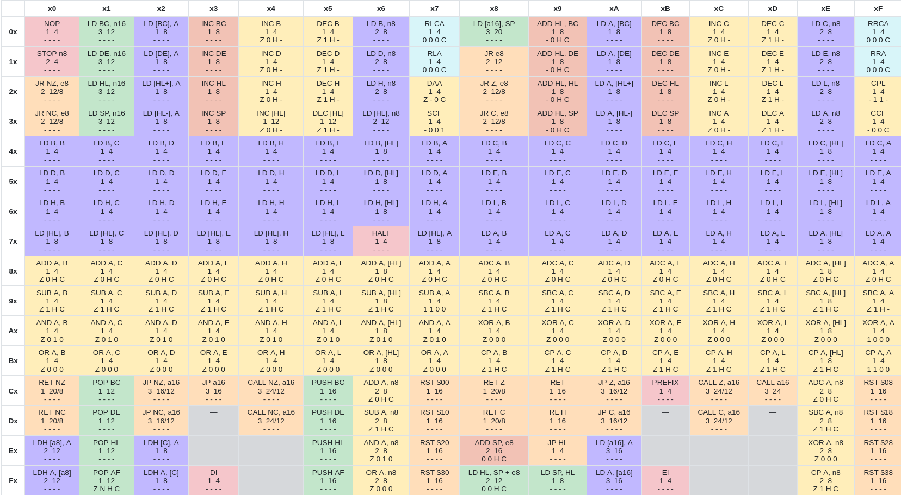
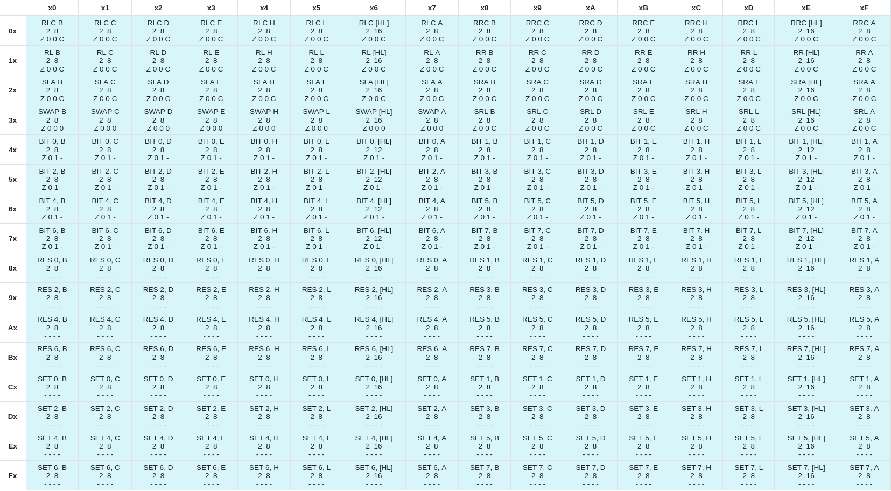

Someone gifted me the [Anbernic RG 35XX](https://anbernic.com/en-fr/products/rg35xx) game console, 
which has some nice emulation capabilities, mainly for the GameBoy Advance games, so I got decently
addicted to the [Advance Wars](https://en.wikipedia.org/wiki/Advance_Wars) games!

I have been interested for some time now in coding a gameboy emulator, and this was what ended up motivating me to do so.

# Scope

The main goal of this project is to code and emulator, able to run basic games like **Tetris**, with a decently accurate clock.

This was indeed met at the end of the project, yet audio is not implemented, at the time of writing this, and the Timer interrupts are really bugged.

Now the code is in my [github](https://github.com/Pi3dra/RustBoi) repo.

# Structure

A GameBoy emulator is composed by many different **software** and **hardware** parts, as a matter of a guide through this post, I'll mainly talk about these:

- [CPU](#CPU)
- [PPU](#PPU) (Pixel Processing Unit, you can see this as a GPU) 
- [Memory](#Memory)
- [Joypad](#Joypad)
- [Timer](#Timer and Interrupts)
- [Interrupts](#Timer and Interrupts)


# Resources

Before going on to my code, I will say that most information from this blog is basically a resume on everything I gathered from these sites:

- [Opcode table](https://gbdev.io/gb-opcodes/optables/)
- [Game Boy: Complete Technical Reference](https://gekkio.fi/files/gb-docs/gbctr.pdf)
- [Pan Docs](https://gbdev.io/pandocs/About.html)
- [Timer Implementation details](http://www.codeslinger.co.uk/pages/projects/gameboy/timers.html)
- [The Ultimate Gameboy Talk](https://www.youtube.com/watch?v=HyzD8pNlpwI) -> Great video on GameBoy Emulation, Highly recommended!
- [Blarg Test Roms](https://github.com/retrio/gb-test-roms)
- [Game Boy Doctor](https://github.com/robert/gameboy-doctor) -> quick and dirty debugging for blarg tests.
- [Dmg acid 2](https://github.com/mattcurrie/dmg-acid2) -> Test ROM for PPU Implementation
- [Gameboy Button Test](https://github.com/bbbbbr/gameboy_button_test)

# Memory

Memory is probably the most straightforward part of the GameBoy, and one of the first things to implement.

All information can be found here: https://gbdev.io/pandocs/Memory_Map.html
And all the following code is under the **bus.rs** file.

## implementation

I defined the following struct:

```rust
struct Memory {
    rom0: [u8; 16_384], //16Kib
    romn: [u8; 16_384], //16Kib

    vram: [u8; 8_192], //8Kib
    ram: [u8; 8_192], //8Kib

    wram1: [u8; 4_096], //4Kib
    wram2: [u8; 4_096], //4Kib
    hram: [u8; 127],

    oam: [u8; 160],

    io: [u8; 128],
    interrupt: [u8; 1],
}```

Then I implemented a **function** which maps and address to one of the actual memory sections.

One interesting thing to note, is that we could implement memory as a contiguous array, but the advantage of doing it this way is that it makes it easier to perform [memory banking](https://gbdev.io/pandocs/MBC1.html) of the **romn** section of memory. This allows to run more complex games, which can use different MBC chips.

I didn't implement MBC features as by default we can run small 32Kib games like Tetris.

Then I defined the following wrapper structure to hold the Memory and Joypad:

```rust
pub struct Bus {
    memory: Memory,
    joypad: u8,
}```


with the following trait:

```rust
pub trait BusAccess {
    fn read(&self, addr: u16) -> u8;
    fn write(&mut self, addr: u16, value: u8);
}
```

which allows to implement different read and write functions to memory to help handle differents behaviours between the CPU and PPU. Also note that the **Memory** struct has two defined functions read and write, to facilitate writing to memory.

There are also some simple functions to load ROMs in the correct places in memory.

Then later in the code, we define the following GameBoi struct:
```rust
pub struct GameBoi {
    cpu: CPU,
    ppu: PPU,
    bus: Rc<RefCell<Bus>>,
}```

These allows us to mutably share the state of memory between the CPU, and BUS.

We'll come back to this struct later, as it is the glue that holds all parts of the GameBoy.


# CPU

For me this was one of the most interesting parts, and one of the first I implemented along with memory. 

I found it relly interesting as we clearly understand how a cpu fetches and executes instructions from actual code.


## Registers

The CPU has the following architecture:

- 8 8-Bit registers **(A F B D H C E L)**
Which can be combined together to form 4 16-Bit registers **(AF BC DE HL )**

We also have two very important 16-Bit registers:
- SP (The Stack Pointer)
- PC (The Program Counter)

It is also important to note that the **F** register, is the flag register, which tracks different flags through the bits **4-7**.

| Bit | Name| Explanation |
| --- | --- | ----------- |
|  7|  z| Zero flag |
| 6 |  n  | Subtraction flag (BCD)|
| 5 |  h| Half Carry flag (BCD)|
|  4|  c| Carry flag|

More information on the flag register here:
https://gbdev.io/pandocs/CPU_Registers_and_Flags.html

## Instruction sets

Instructions or "Opcodes" on the GameBoy, are **8-Bit**, represented in Hexadecimal:

like so : **0x06** -> LD B, n8 

which in this case would be the instruction to load the next imediate byte into the **B** register.

So basically a GameBoy **ROM** is a very long list of Hexadecimal 8 bit opcodes or imediate values.

Opcodes can be easily decoded by the following table: 



One thing to take in consideration, is that if we have 8-Bit Opcodes, we can only have up to **256** different Opcodes.
But the GameBoy has more than that, to achieve so, the GameBoy uses variable length encoding, if the opcode is prefixed by **0xCB**, the GameBoy executes instructions from this table:




There are **three** remaining things to take in consideration when decoding this instructions:

The first and most important one,is the **clock cycles** the instruction takes to execute, which are specified on the table.
these cycles can be either, **T-Cycles** or **M-Cycles**.

**T-cycles** are the smallest unit of time for the Game Boy CPU.

1 T-cycle = one clock tick

The Game Boy CPU clock runs at 4,194,304 Hz so 1 T-cycle ≈ 238 ns

On the other hand, **M-cycles** are groups of **T-cycles**.

1 M-cycle = 4 T-cycles

M-cycles represent higher-level CPU actions.


Now the second thing to take into account, are instruction lenght (in **bytes**), this lenght as we can say can vary, mainly if the instructions are **0xCB** prefixed, or if they read imediate **bytes** from memory. This is what indicates how many steps we need to advance the **PC** register.

The last and most important part are the actual **arguments** the instruction uses, there are many, and different sized ones, so I wont go into detail.
but you can find more about it, in the [Resources](##Resources) section.


Basically after loading the game **ROM** on memory, and pointing the **PC** register to the starting adress of the code (0x0100).

We then read opcodes sequentially.
If we read 0xCB, we read the Opcode table 2, else we read the Opcode table 1.
We execute the instruction, and we increment the **PC** and the **clock** timer accordingly.


## Implementation

I won't go into great detail about the code here, but the implementation is shared between the following files.

Also an important part of the implementation, is checking that the **CPU** actually works, to do so, somehting that saved me a **TON** of time, is using the *Blargss* test **ROMs**, and the **GameBoy** doctor script, to compare my logs with the logs of an actually working **CPU**, both these scripts can be found in the [Resources](##Resources) section.

Also, you need to implement [serial data transfer](https://gbdev.io/pandocs/Serial_Data_Transfer_(Link_Cable).html)to actually get information from the **Blargg** tests

### Cpu.rs
Here we can find the implementation of the **CPU** struct, with all the previous information.

The core of the CPU is represented by this struct:

```rust
pub struct CPU {
    bus: Rc<RefCell<Bus>>,
    registers: Registers,
    opcode_table: [InstrPointer; 256],
    cb_table: [InstrPointer; 256],
}

pub struct Registers {
    a: u8,
    f: u8, // Flags register 4: carry 5: half_carry 6: sub 7: zero
    b: u8, // BC 16 bits
    c: u8,
    d: u8, // DE 16 bits
    e: u8,
    h: u8, // HL 16 bits
    l: u8,
    sp: u16, // Stack pointer
    pc: u16,
}
```

And the implementation of a generic instruction would look like so: 

```rust
    pub(crate) fn add(&mut self, op1: Operand, op2: Operand) {
        let value1: u8 = self.get_operand_as_u8(op1);
        let value2: u8 = self.get_operand_as_u8(op2);
        let (result, overflowed) = value1.overflowing_add(value2);
self.set_operand_from_u8(op1, result);

        let half_carry: bool = ((value1 & 0xF) + (value2 & 0xF)) > 0xF;
        self.update_flags(result == 0, false, half_carry, overflowed);
    }
```

This implements the add operation for all possible Operands that can indeed perform addition!

I defined a generic **get** and **set** functions which act on Operands, this comes in very handy for implementing generic, operations.


### Mod.rs

This script declares the **CPU** module, and defines all the necessary **Operands** as **enums**.

### Opcode.rs

This script initializes all the opcode tables we saw previously, and defines an **InstrPointer** enum, which allows for dynamic dicalling of instructions:

```rust
pub enum InstrPointer {
    Binop(fn(&mut CPU, Operand, Operand), Operand, Operand, u16),
    Unop(fn(&mut CPU, Operand), Operand, u16),
    Const(fn(&mut CPU), u16),
    None, //For unused opcodes
}
```

This enums holds a pointer to the actual pointer of the function, the different operands, and the clock cycles it takes to execute as a **u16**


```rust
let inc = Unop(CPU::inc, R8(A), 0);
```

this would be the definition of the **INC A** Opcode, which increases the **A** register by one.

we then define **InstrPointers** for all opcodes, in the following tables:

```rust
let mut table: [InstrPointer; 256] = [None; 256]; // default NOP
let mut cb_table: [InstrPointer; 256] = [None; 256];
```

Then these tables are later used in the **CPU**  **step** function, which works like so:

```rust
pub fn step(&mut self) -> u8 {

        //Handle Interrupts and halting...

        let pc = self.registers.get_16register(PC);
        let opcode = self.read(pc);
        let cycles: u8 = {
            if opcode == 0xCB {
                let opcode2 = self.read(self.registers.pc.wrapping_add(1));
                self.registers.pc = pc.wrapping_add(2);
                self.execute_from_instr(self.cb_table[opcode2 as usize], opcode2)
            } else {
                self.registers.pc = pc.wrapping_add(1);
                self.execute_from_instr(self.opcode_table[opcode as usize], opcode)
            }
        };
        self.handle_interrupts();
        cycles
    }

```

# PPU

I think it would be safe to say that the **PPU**, is by far the most complex part of the GameBoy, if one wants to implement it in an accurate and precise manner, without bypassing core mechanics of the PPU.

This difficulty mainly comes by the fact that the **PPU** does many many different smalls things, which individually are simple, but to glue them all together becomes rather hard, and a bug in any of the parts, can severely mess up the whole thing, another thing which is rather painfull, is that there are many **registers** and **flags** which many parts of the **PPU** tracks and uses.

I'll provide a decent overview but, I won't go into all the detail, as this is explained in great detail of in the **pandocs** and **the ultimate gameboy talk** in [Resources](##Resources).

At the time of writing, my implementation has some small bugs, and the code could be cleaner, but it works well enough.
But I tried to implement it as close to the documentation as I could.

To implement the PPU, I strongly advice to first have a fully working memory, and CPU implementation.


## RetroArch
This is the right time to introduce [RetroArch](https://www.retroarch.com/)!.

**Retroarch** is basically a frontend for **emulators** , **game engines** and **media players**

The advantage of using **RetroArch** is that you can focus exclusively, on the emulator code, and let **RetroArch** actually handle compatibility between multiple platforms, and the screen and sound output, and many other things.

Implementing the **API** was rather easy, and quickly facilitated by the [libretro-rs](https://crates.io/crates/libretro-rs) crate.

This **API** is basically what glues everything together, **CPU**, **Memory** and **PPU**, I'll go back to this later.

## PPU Components

Some small but important details:

The *screen* of the GameBoy, is **160x144** pixels, which corresponds to *20x18* *8x8* tiles.
Everything in the screen is colored in 4 shades of gray, and in a single line, we can render a maximum of **10** object sprites.

This is what we will be working with the whole time.


### Palettes


A palette consists of an array of colors, 4 in the Game Boy’s case. Palettes are stored differently in monochrome and color versions of the console.

Modifying palettes enables graphical effects such as quickly flashing some graphics (damage, invulnerability, thunderstorm, etc.), fading the screen, “palette swaps”, and more.

There are 3 different palettes:

- **0xFF47** -> Background Palette
- **0xFF48** -> Object Palette 0
- **0xFF49** -> Object Palette 1

We can modify these palettes, in which every 2 bit pairs correspond to a color, like so:

| Bits | Color |
| ---- | ----- |
|6-7 | Color for 11|
|4-5 | Color for 10|
|2-3 | Color for 01|
|0-1 | Color for 00|

With the following native mappings:

00 -> White
01 -> Light Gray
10 -> Dark Gray
11 -> Black

So consequently if we set the bits *6-7* of the *0xFF47* register to **00**, all background tiles using **11** would map to a white pixel.

### Tiles 

All the graphics in the GameBoy are represented by tiles.

These tiles are *8x8* Pixels, and take *16 bytes* in memory, with every *2* consecutive bytes represent a line of the tile.

Consequently the first line of a tile can be represented like so:

**0x3C 0x7E = 00111100 + 01111110 = 00 10 11 11 11 11 10 00**

And the remaining 2 bit pairs at the end, map to one of th 4 colors of the currently used **palette**

The actual tile data is stored in VRAM in the memory area at **0x8000-0x97FF**, this area defines data for 384 tiles. 

The tiles are stored in two, **32×32** tile maps in VRAM at the memory areas **0x9800-0x9BFF** and **0x9C00-0x9FFF** Any of these maps can be used to display the **Background** or the **Window**.

Do not confuse the tile **data** with the tile **maps**, the data holds the actual tile image if you will, while the tile maps actually sotres the adresses that map directly to the tile **data** so they can be displayed on screen.

more info here: https://gbdev.io/pandocs/Tile_Maps.html


### Background

If you paid enough close attention, you may have noticed that the screen can display up to **20x18** tiles, but the tile maps hold **32x32** tiles, which means the screen serves as a small viewport on the tile map stored in **VRAM**.

To render the viewport correctly, we need to keep track of the following register:
    - **0xFF42**  -> Scroll X register
    - **0xFF43**  -> Scroll Y register

Which allows programmer to move the viewport around with pixel precision.

This is also the source of many different raster effects, and how many games generate linear worlds, by scrolling the screen to track de player, and changing the tile map when the player can't see it.

It is also intersting to note that the viewport actually wraps around the tile map, if we are close to the right borders the GameBoy will display the start of the left border.

### Window

I'll be brief about this one, as it's name its rather clear.

It's a window displayed on top of the background, and is often used to display the **UI** and **HUDs**, with information like, remaining lives, scores , etc.

It has it's own registers to move it around and activate or deactivae it.

### Objects or sprites

These can represent the sprites of players, enemies, items, etc.

Their main characteristic is that we can place them freely, on our grid.

Their information is stored in **OAM Memory**, and each object holds the following information:

- **Byte 0 - Position Y**
- **Byte 1 - Position X**
- **Byte 2 - Tile Info** -> The adress of the tile to be displayed
- **Byte 3 - Flags**

With the flag register being defined like so: 

|bit|7|6|5|4|3|210|
|---|-|-|-|-|-|---|
|Attributes|Priority|Y flip|X flip|DMG palette|Bank|CGB palette|


For more info check : https://gbdev.io/pandocs/OAM.html

I won't go into detail about it here, but developers use the [OAM DMA Transfer](https://gbdev.io/pandocs/OAM_DMA_Transfer.html) procedure to write to OAM, so this is very important for sprite rendering!

## Rendering

The GameBoy renders very much like a **CRT** screen, pixel by pixel, line by line, from left to right.

This might seem rather weird this days because the GameBoy has an acutal **LCD** Screen.

But there are many reasons to justify this choice:
The Game Boy PPU is conceptually descended from **NES PPU** and **SNES PPU** which used actual **CRT** screens.
Those chips were already:

- Tile-based
- Scanline-oriented
- Deterministic and cheap

Nintendo engineers already knew how to build these, and they worked reliably.

Also this line by line rendering is what allows raster effects, and many other effects, as we can actually stop after drawing a line, and change some registers like *SCX* for the next line.

So drawing a line passes through 3 Cycles:

| OAM Scan | Drawing Pixels | H-Blank |
| -------- | -------------- | ------- |
| 20 Cycles | 43 Cycles | 51 Cycles |


Clock cycles here are given in **M-Cycles**.


**OAM Scan** searchs the objects to be rendered on the current line.

**Drawing Pixels** pops pixels from 2 different pixel FIFOS to the screen.
Important: During this face the **CPU** shouldn't be able to write to memory!

**H-Blank** corresponds to the horizontal time it takes a CRT screen to go back to the start of the next line, it's idle time.


Then after drawing **144** Lines, the **PPU** draws **10** more, which are actually not visible, and correspond to the **V-Blank** status, which is the same concept as the **H-Blank** but it last's longer.

As one could have guessed it is safe to read and write memory from the **CPU** when the **PPU** is idling in any of these modes.

### The Actual Pipeline

To allow this pixel by pixel rendering, the **PPU** has an atomically simple pipeline, but together it is a rather complex state machine.

Which have two different parts: The pixel fetcher, and two different pixel FIFOs, one for the background and another one for sprites!

These run closely in sync, and work together to pop pixels to the screen!
  
### Pixel Fetcher

The pixel fetcher has 4 states, each taking 2 **M-Cycles**:

```rust 
enum FetcherState {
    GetTileIndex,
    GetTileLow,
    GetTileHigh,
    PushToFifo,
}
```

- **GetTileIndex** retrieves the adress of the tile to be displayed from the tile maps.

As we discussed before tile lines are composed of two bytes, so we retrieve one by one:

- **GetTileLow** retrieves the **first** byte of the current line and current tile being displayed.
- **GetTileHigh** retrieves the **second** byte of the current line and current tile being displayed.

Finally:

- **PushToFifo** pushes the whole 8 pixels of the line, to any of the two Pixel FIFOs.


**GetTileIndex** and **PushToFifo** are heavily dependant on many registers, for extra information like where to fetch the tile data and which FIFO to push to.

The Fetcher, has many different edge cases, that I wont detail here, for that check this: https://gbdev.io/pandocs/pixel_fifo.html.


I defined the following structure for the Fetcher:

```rust 
struct PixelFetcher {
    bus: Rc<RefCell<Bus>>,
    clock: u8,
    state: FetcherState,
    // Some variables to keep track of current position!
    internal_ly: u8,
    tile_x: u8, // Current horizontal tile index
    tile_y: u8, // Current vertical tile index (or LY / 8)
    tile_index: u8,
    low_byte: u8,
    high_byte: u8,
    window_line: u8,
}
```

The Fetcher goes through these states in the same order as they are specified in the enum, top to bottom.

I defined a function for each state, and basically the Fetcher steps like so: 

```rust
 fn step(&mut self, fifo: &mut PixelFIFO, mut cycles: u8) {
        match self.state {
            GetTileIndex => {
                self.get_tile_idx();
                cycles = cycles - 2;
            }
            GetTileLow => {
                self.get_tile_low();
                cycles = cycles - 2;
            }
            GetTileHigh => {
                self.get_tile_high();
                cycles = cycles - 2;
            }
            PushToFifo => {
                self.push_to_fifo(fifo);
                cycles = cycles - 2;
            }
        }
```

Note that the Fetcher can only push to FIFO if the FIFOs, have enough place for *8 Pixels* more on that on the following section. Which means that we can have some stalling in this state machine.


### Pixel FIFOS

Now onto the drawing to screen, which is actually handled by two pixels FIFOs, the background one, and the sprite one.

The FIFOs once again, are rather simple, and I defined them like so:

```rust
#[derive(Copy, Clone)]
pub struct Pixel {
    pub color: u8,          // 0–3 after palette
    pub _bg_priority: bool, //Not used yet (only for GBC)
    pub sprite_priority: bool,
    pub palette: Option<u8>,
}

struct PixelFIFO {
    queue: VecDeque<Pixel>,
}
```

It also has the following characteristics: 

It can store up to **16 Pixels** i.e 2 Tile lines.

And it pops 4 pixels per **M-Cycle** or 1 pixel per **T-Cycle**, only if it has more than **8 Pixels**, this is useful for actual pixel mixing, more on that later.

So if we break down the interaction between the FIFOs and the Fetcher  down to **T-Cycles**, the FIFOs can push up to two pixels per Fetcher State.


### Implementation

All the previous and following code is in the **cpu.rs** file, it is a bit overcrowded, but I didn't have the time to reorganize.
So to put it all together I defined the PPU structure like so:

```rust
pub enum State {
    OAMSearch = 2,
    PixelTransfer = 3,
    HBlank = 0,
    VBlank = 1,
}

pub struct PPU {
    bus: Rc<RefCell<Bus>>,
    framebuffer: Option<[u8; WIDTH * HEIGHT]>,
    viewport: [u8; WIDTH * HEIGHT],

    state: State,
    fetcher: PixelFetcher,
    bg_fifo: PixelFIFO,
    obj_fifo: PixelFIFO,

    //variables to track extra info and states have been hidden here

    line_objs: Option<Vec<Obj>>, // results from OAM Search
}
```

Here the viewport is where we draw pixel by pixel, and once it is full we clear it to start a new frame and give the old frame to the **RetroArch** API, through the framebuffer, so the frame can be properly displayed.


The **PPU** switches through the different states like so:

```rust
pub fn step(&mut self, cycles: u8) {
        let mut overflow = None;

        // Helper to consume cycles and detect overflow let mut consume = |duration: u16| -> u8 {
            let total = self.clock + cycles as u16; //112 + 32 -> 144 clock after execution
            if total > duration {
                //144 > 80
                let remainder = total - duration; //After OAMSearch, we will have an overflow of
                //64 cycles
                overflow = Some(remainder); //Some(64)
                remainder as u8 //64
            } else {
                0
            }
        };

        let consumed = match self.state {
            OAMSearch => {
                let remaining = consume(self.state_duration()); // 64
                self.oamsearch(cycles.saturating_sub(remaining) as u8); // we give 112 - 64 , 48
                // ticks to oam
                if remaining > 0 {
                    //yes
                    self.change_to_state(PixelTransfer, remaining as u8); // change_to_state(64)
                }
                cycles.saturating_sub(remaining)
            }

            PixelTransfer => {
                let remaining = consume(self.state_duration());
                self.pixeltransfer(cycles.saturating_sub(remaining) as u8);
                if remaining > 0 && self.popped_pixels >= (self.fine_scroll_x as u16 + 160) {
                    self.change_to_state(HBlank, remaining as u8);
                }
                cycles.saturating_sub(remaining)
            }

            HBlank => {
                let remaining = consume(self.state_duration());
                self.hblank(cycles as u8); // I don't remember why I aint consuming here? 
                if remaining > 0 {
                    let prev_ly = self.read(LY);
                    self.increment_ly();
                    let next_state = if prev_ly == 143 { VBlank } else { OAMSearch };
                    self.change_to_state(next_state, remaining as u8);
                }
                cycles.saturating_sub(remaining)
            }

            VBlank => {
                let remaining = consume(self.state_duration());
                self.vblank(cycles.saturating_sub(remaining) as u8);
                if remaining > 0 {
                    self.framebuffer = Some(self.viewport.clone());
                    self.change_to_state(OAMSearch, remaining as u8);
                }
                cycles.saturating_sub(remaining)
            }
        };

        // Update clock: if no overflow, add consumed cycles; otherwise, set to overflow
        self.clock = overflow
            .map(|o| o as u16)
            .unwrap_or_else(|| self.clock + consumed as u16);
    }
}

```

OAMSearch is the most straightforward state, we fetch all the line sprits at once, then we stall the remaining cycles of the OAMSearch.

```rust
 fn oamsearch(&mut self, _cycles: u8) {
        if !matches!(self.line_objs, None) {
            return; // This means oamsearch has already been done, we are just stalling to simulate
            // cycles now
        }

        //Sprite size is variable, look at the docs for more info 
        let lcdc = LcdcRegister::new(self.read(LCDC));
        let sprite_height = { if lcdc.obj_size { 16 } else { 8 } };

        //This fetches all objects in OAM
        let oam_data = self.fetch_objects_from_oam();
        let ly = self.read(LY);


        let mut objects_to_draw: Vec<Obj> = vec![];
        for object_data in oam_data {
            let sprite_top = object_data.y.wrapping_sub(16);
            let sprite_bottom = sprite_top.wrapping_add(sprite_height);

            if ly >= sprite_top && ly < sprite_bottom { // This is the actual condition to check if objects are being drawn
                if objects_to_draw.len() < 10 { //This enforces the 10 Objects per line limit
                    objects_to_draw.push(object_data);
                } else {
                    break;
                }
            }
        }
        objects_to_draw.sort_by_key(|obj| obj.x); // This is necessary for proper function
        self.line_objs = Some(objects_to_draw);
    }
```

The nexs state is PixelTransfer which is way more complicated. Here it may seem rather straightforward, but the helper functions hide a lot of of the intricate parts.


```rust
fn pixeltransfer(&mut self, cycles: u8) {
        for _ in 0..cycles { // this is a source of cycle inaccuracy to be fixed later
            self.fetcher.step(&mut self.bg_fifo, 2); // we step the fetcher by two cycles

            //There should be more than 8 pixels to pop the bg_fifo
            if self.bg_fifo.queue.len() < 9 {
                return; // do not pop yet
            }

            //If there are objects at current coordinates push their pixels into obj_fifo
            let current_x = self.popped_pixels as i32;
            if let Some(obj) = self.objects_at(current_x) {
                self.update_obj_fifo(obj);
            }

            //This both pops and mixes pixels
            let pixel_to_draw = self.mix_fifo_pixels();

            //We discard useless pixels, so we keep popping
            if self.popped_pixels >= self.fine_scroll_x as u16 {
                let visible_x = (self.popped_pixels - self.fine_scroll_x as u16) as usize;
                if visible_x < WIDTH {
                    let idx = self.read(LY) as usize * WIDTH + visible_x;
                    self.viewport[idx] = pixel_to_draw;
                }
            }
            self.popped_pixels += 1;
        }
    }

```

Then finally the HBlandk and VBlank states are basically idling.


One interesting thing to note is that the PPU has a set of hardware interrupts, which I don't talk about here.
but these allow programmers to stop and do things between line draws.


**Debugging:** To debug the **PPU** I basically used print statements, and the **DMG Acid2** test ROM.


# Joypad

The JoyPad is not that complicated, but I found that the documentation was rather obscure about it, so I'll try and shed some light on it.

Basically the register handling input, doesn't represent the currently pressed buttons, but the buttons the programmers decide to test.

So the programmer writes to the register to test if the A button is pressed, and the next time we read the register instead of it being the filter, it is the actual information telling the programmer if the button A button is pressed.


The bits of the joypad register are structured like so:

| |7 6|5|4|3|2|1|0|
|-|--|-|-|-|-|-|-|
|P1|  |Select buttons|Select d-pad|Start / Down|Select / Up|B / Left|A / Right|


So when the CPU writes to **JOYP 0xFF00** it is telling the GameBoy which buttons it wants to check.

Then and only then when the CPU reads the same register, it now gets, the same register layout, specifiying which buttons are pressed.

So to implement this behaviour, it is easier to have an extra place in memory actually storing the joypad, in my case, I added a **joypad : u8** variable, in my memory bus.

Now when I press buttons, RetroArch, sets the joypad variable with a mask specifiying which buttons are pressed, fires the JOYPAD hardware interrupt, and then the program reads the **JOYP** register, which instead of returning the actual **JOYP** register in memory (The one acting as a filter), it return the joypad mask, modified to match the filter.

To understand a bit better you can look in the following files:

- **bus.rs**
- **lib.rs**
- **gameboi.rs**


To test this I listed a test ROM in the [Resources](#Resources) section.

# Timer and Interrupts

Timer and Interrupts are rather comlex, obscure and not so well documented aspects of the GameBoy.

My implementation is still rather bugged, and I would advice against re-using my code, There's more concrete information to gather in the documenataion or more complete implementations of GameBoy emulators.

Anyhow, the basic interrupts to implement to get a working emulator are:

- Joypad
- LCD
- VBlank

I would strongly sugest to put the Clock and Interrupt handling structures in a separate file, even a separate module.

As interrupts can be fired for many different sources, and the clock can be changed from other places as well.

My code assumes the clock is inside the CPU struct, as well as the interrupt handler.

# Putting it all together

To finalize I'll talk briefly about the **RetroArch** lib, and how to glue together all the different components of a GameBoy emulator.

this is almost the whole **gameboi.rs** with glues everything together without the RetroArch lib.

```rust
pub struct GameBoi {
    cpu: CPU,
    ppu: PPU,
    bus: Rc<RefCell<Bus>>,
}

impl GameBoi {
    pub fn new() -> Self {
        let bus = Bus::empty();
        let ppu = PPU::new(bus.clone());
        let cpu = CPU::new(bus.clone());
        Self { cpu, ppu, bus }
    }

    pub fn load_rom_from_path(&mut self, rom_path: &str) {
        self.bus.borrow_mut().load_rom(rom_path);
    }

    pub fn load_rom_from_data(&mut self, rom_data: &[u8]) {
        self.bus.borrow_mut().load_rom_data(rom_data);
    }

    pub fn receive_input(&mut self, pressed_mask: u8) {
        let mut bus = self.bus.borrow_mut();
        let trigger_interrupt = bus.set_joypad(pressed_mask);

        if trigger_interrupt {
            let if_reg = bus.read(IF, false);
            bus.write(IF, if_reg | 0x10, false);
        }
    }

    pub fn step(&mut self) -> [u8; 23040] {
        while !self.ppu.is_frame_ready() {
            let cycles = self.cpu.step();
            self.ppu.step(cycles * 2); 
            //ppu.print_state();
        }
        let frame = self.ppu.yield_frame();
        self.ppu.clear_buffer();
        frame
    }
}
```


Basically the step functions calls the **CPU** it executes one **CPU** instruction, and returns the used cycles to the **PPU**, doubled by 2 , as the PPU runs twice as fast.

It continues executing instructions until it has rendered a complete frame, and returns it.

Then to connect everything to the **RetroArch** API, we can take a look at the **lib.rs** file:

```rust
struct RustBoiCore {
    framebuffer: [u16; WIDTH * HEIGHT],
    gameboi: GameBoi,
}

use RetroJoypadButton::*;
impl RetroCore for RustBoiCore {
    fn init(_env: &RetroEnvironment) -> Self {
        Self {
            framebuffer: [0; WIDTH * HEIGHT],
            gameboi: GameBoi::new(),
        }
    }

    fn get_system_info() -> RetroSystemInfo {
        RetroSystemInfo::new("RustBoi", "1.0").with_valid_extensions(&["gb", "gbc", ".gb", ".gbc"])
    }

    fn reset(&mut self, _env: &RetroEnvironment) {
        self.framebuffer = [0xFF; WIDTH * HEIGHT];
        self.gameboi = GameBoi::new();
    }

    fn run(&mut self, _env: &RetroEnvironment, runtime: &RetroRuntime) {
        let mut pressed = 0xFF;

        /*
        some snipped code which cheks the runtime to update the pressed buttons pressed mask
        */


        self.gameboi.receive_input(pressed);

        // Run one full frame → you get [u8; 23040] of color indices (0-3)
        let raw_frame: [u8; WIDTH * HEIGHT] = self.gameboi.step();

        // Convert DMG color index (0-3) → RGB565 u16
        for (i, &color_index) in raw_frame.iter().enumerate() {
            self.framebuffer[i] = dmg_to_rgb565(color_index);
        }

        // SAFETY: &[u16] has the same memory layout as &[u8] with double the length
        // This is safe because u16 has no padding and alignment is fine on all platforms
        let bytes: &[u8] = unsafe {
            std::slice::from_raw_parts(
                self.framebuffer.as_ptr() as *const u8,
                self.framebuffer.len() * std::mem::size_of::<u16>(),
            )
        };

        // Now upload as raw bytes with correct pitch
        runtime.upload_video_frame(bytes, WIDTH as u32, HEIGHT as u32, WIDTH * 2);
    }

    fn load_game(&mut self, _env: &RetroEnvironment, game: RetroGame) -> RetroLoadGameResult {
        println!("LOADING!");
        match game {
            RetroGame::Path { path, .. } => {
                self.gameboi.load_rom_from_path(path)
            }
            RetroGame::Data { data, .. } => {
                self.gameboi.load_rom_from_data(data)
            }
            RetroGame::None { .. } => panic!(),
        }

        let video = RetroVideoInfo::new(
            59.7275, // GB framerate
            WIDTH as u32,
            HEIGHT as u32,
        )
        .with_pixel_format(libretro_rs::RetroPixelFormat::RGB565);

        let audio = RetroAudioInfo::new(44100.0);

        RetroLoadGameResult::Success { audio, video }
    }
}

libretro_core!(RustBoiCore);
```

# Notes & Disclaimers

This is by no means a full GameBoy implementation, But I think it is a helpful blog to get you started.

It was a really interesting project, which I would highly recommend to anyone interested on emulation.
Also if you are new to programming it might be easier to start emulating simpler systems like [Chip 8](https://tobiasvl.github.io/blog/write-a-chip-8-emulator/)

At the time of writing, the Interrupts and timer have some bugs, which make games with complex animations, basically unplayable, nevertheless, Tetris is playable, as expected by the scope.

Also something I would **HIGHLY** recommend, Is to write a **debugger**, to enable step by step execution, with the most information possible.
As it was really hard to debug this projects with print statements and logs, even if the test **ROMs** helped a great deal.

To highlight this fact, I don't think I will continue developping this emulator, until writing a proper **debugger** for it.
